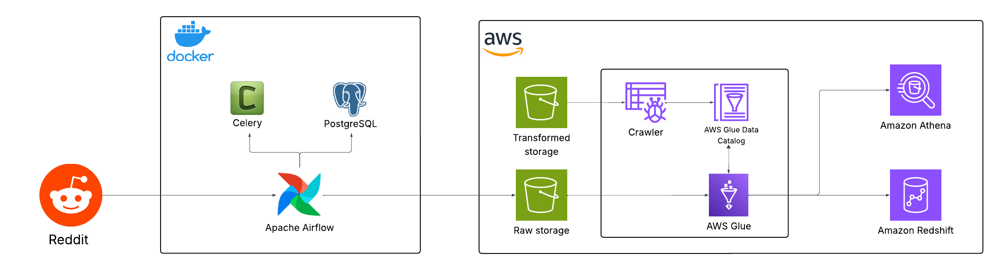

# Project Title
### | **Reddit data pipeline**

# Overview
This project builds a data pipeline with Apache Airflow to orchestrate data extraction from Reddit, and leverages AWS services such as Glue, Athena, S3 to perform ETL operations on the data. The processed data is finally loaded into AWS Redshift for analytical purposes

**📌 Note:** This project was developed as a hands-on learning project based on a tutorial, with the goal of practicing building data pipeline using Apache Airflow and AWS services 

# Objectives
- Understand how to orchestrate data workflows using Apache Airflow
- Learn how to extract data from external API (Reddit) and store it in AWS S3 from Apache Airflow
- Apply AWS Glue and Athena for data transformation and querying
- Utilize Amazon Redshift to load transformed data for analytics
  
# Project Architecture

- **Apache Airflow, Celery, PostgreSQL:** orchestrates the pipelines and manages Airflow's metadata 
- **AWS S3:** stores raw and transformed data
- **AWS Glue:** executes ETL jobs and populates data catalog
- **AWS Athena:** allows SQL querying on data stored in AWS S3
- **AWS Redshift:** serves as the data warehouse
  
# Tech Stack
- **Workflow Orchestration & Management:** Apache Airflow, Celery, PostgreSQL
- **Data Storage:** AWS S3
- **Data Processing:** AWS Glue
- **Data Warehouse:** AWS Redshift
- **Language:** Python
  
# Reference Tutorial
- This project is based on the following tutorial: [Reddit Data Pipeline Engineering | AWS End to End Data Engineering](https://www.youtube.com/watch?v=LSlt6iVI_9Y)

- The implementation and explanation in this repository reflect my own learning
